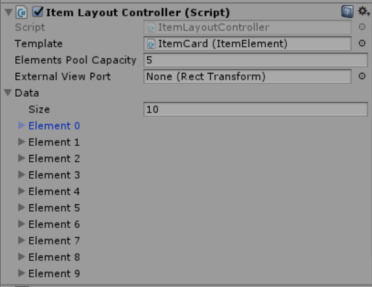

# Unity-Pooled-Scroll-List

An extension for Unity UI that optimizes ScrollRect performance by using a pool of objects and reordering objects in the scroll viewport. 
Supports horizontal, vertical and grid layout groups.

To use the extension it is necessary to create and implement a class inherited from PooledElement and attach it to the prefab that you display in your scroll.
Depending on a layout type you need (horizontal/vertical or grid) create a class inherited from PooledLayoutController or PooledGridController.
Attach it to the GameObject that contains your ScrollRect and provide a reference to the prefab.

```
[Serializable]
public class ItemData
{
    //Contains properties that are displayed on scroll objects
}
    
public class ItemElement : PooledElement<ItemData>
{
    //Resets the object's data when it's outside the scroll viewport
}

//Scroll Controller implementation for horizontal and vertical layout
public class ItemLayoutController : PooledLayoutController<ItemData, ItemElement>
{
}

//Scroll Controller implementation for grid layout
public class ItemGridController : PooledGridController<ItemData, ItemElement>
{
}
```


* [Horizontal & Vertical layout](https://drive.google.com/open?id=1ywgmnCAIkopC6GNVNuF3OuA_d0JgUDQx)
* [Grid layout](https://drive.google.com/open?id=13ms-xuaNFKubY3w2td8vKm5T_VmKZip5)
